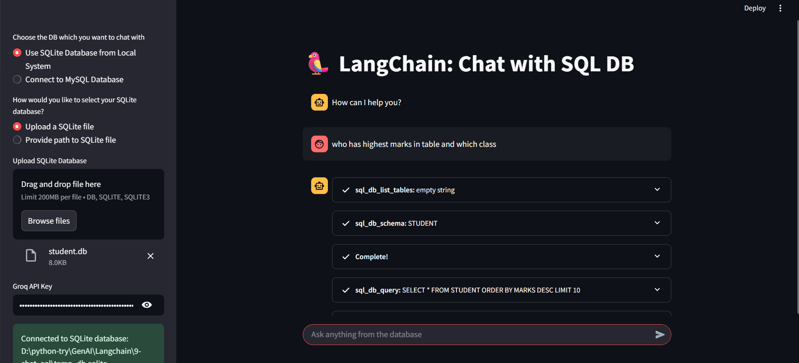
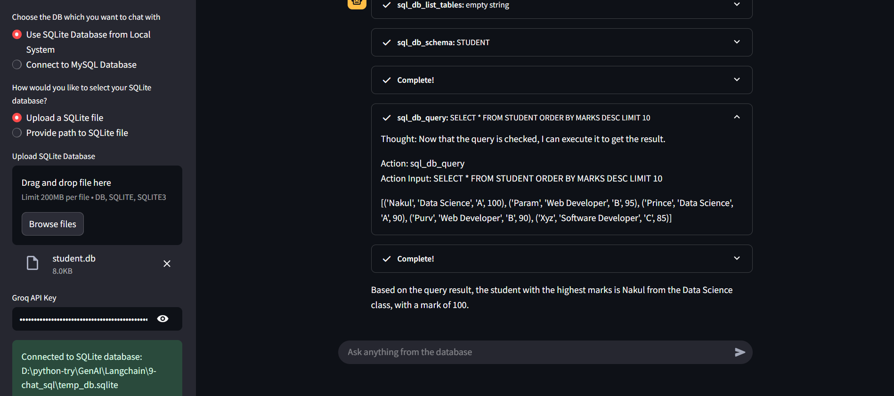
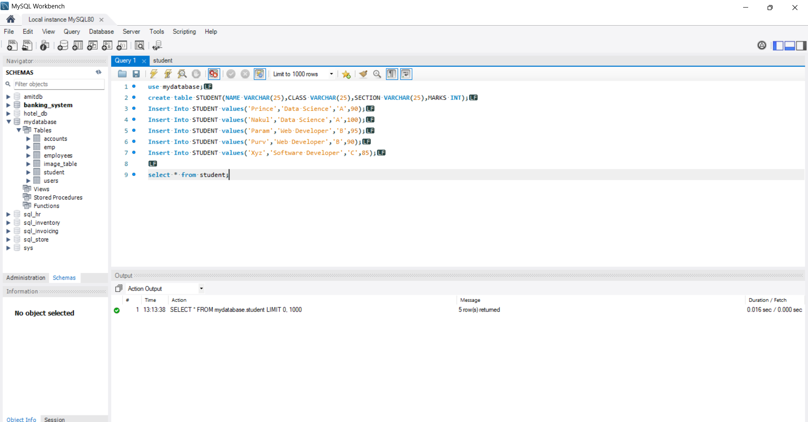
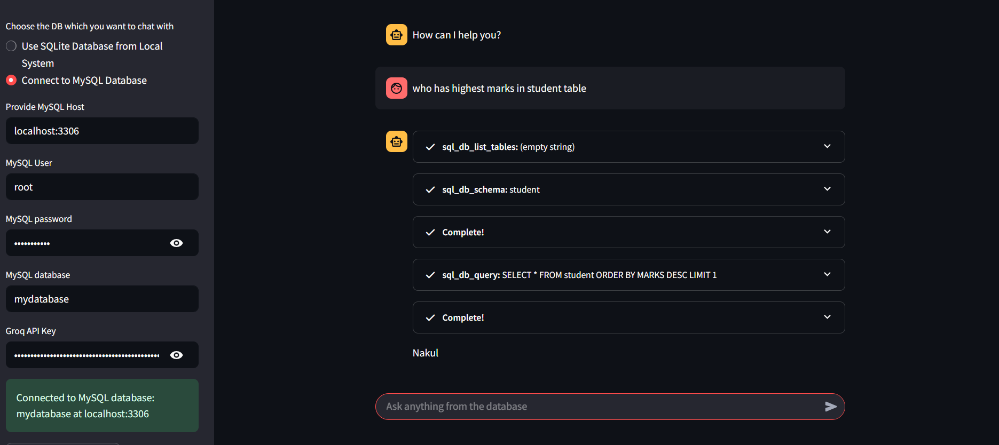

# 🦜 Chat with SQL DB — Powered by LangChain & Groq

This project is an interactive Streamlit-based web application that allows users to **chat with a SQL database using natural language**. Powered by **LangChain** and integrated with **Groq’s LLaMA3 model**, this tool enables users to query and explore both **SQLite and MySQL databases** without writing SQL directly.

---
## live link
https://chat-with-sql-by-prince-patel.streamlit.app/

---
## 💡 Project Overview

LangChain SQL Chat App simplifies database interaction using advanced natural language processing. With support for both **SQLite (local or uploaded)** and **MySQL (remote)** databases, users can ask questions such as:

- “Show all students who scored above 90.”
- “What is the average marks per section?”
- “List all students from the Web Developer class.”

The app translates these queries to SQL using LangChain’s agent-based architecture and displays the results in real-time.

---

## ⚙️ How It Works

### 1. **Choose Your Database**
- From the sidebar, select between:
  - **Upload or provide path to a local SQLite database**, or
  - **Connect to a remote MySQL database** using host, username, password, and DB name.

### 2. **API Key for Groq**
- Enter your **Groq API Key** in the sidebar to initialize the LLaMA3 model for natural language querying.

### 3. **Model & Agent Setup**
- A LangChain agent is created using:
  - The selected database.
  - `ChatGroq` LLM (LLaMA3-8b-8192).
  - `SQLDatabaseToolkit` to support schema understanding and tool invocation.

### 4. **Chat Interface**
- A familiar chat interface allows users to ask natural language questions.
- The agent uses the LLM to interpret, generate SQL queries, and return results.
- Chat history is retained within the session and can be cleared with a button.

---

## 📌 Notes

- No need to store your GROQ API key in a .env file — the key is securely entered by the user through the Streamlit UI at runtime.
- Sample database creation script (`sqlite.py`) is included to populate and test with student records.
- Ensure your Groq API key has sufficient usage limits for LLaMA3 queries.

---

## 🖼️ Some Screenshots of Work

### 📁 Connecting to SQLite Database via File Upload
The application allows you to upload a `.sqlite` file directly, and it automatically connects and extracts the database schema for natural language queries.



---



---

### 🧰 Viewing Tables using SQL Workbench
This screenshot shows the SQL Workbench interface where the database structure can be reviewed and validated before or during chatbot interaction.



---

### 🌐 Connecting to Remote SQL Server
Instead of uploading a file, you can connect to a remote MySQL server by entering four key details: Host, Username, Password, and Database Name.



---

## ⚙️ Setup Instructions

Follow the steps below to run the project locally:

### 1️⃣ Clone the Repository

```bash
git clone https://github.com/prince2004patel/chat-with-sql-db.git
cd chat-with-sql-db
```

### 2️⃣ Create and Activate Conda Environment
- It’s recommended to use a virtual environment to avoid conflicts:
```bash
conda create --name chat-with-sql-db python=3.10 -y
conda activate chat-with-sql-db
```

### 3️⃣ Install Dependencies
```bash
pip install -r requirements.txt
```

### 4️⃣ Run the App
```bash
streamlit run app.py
```
